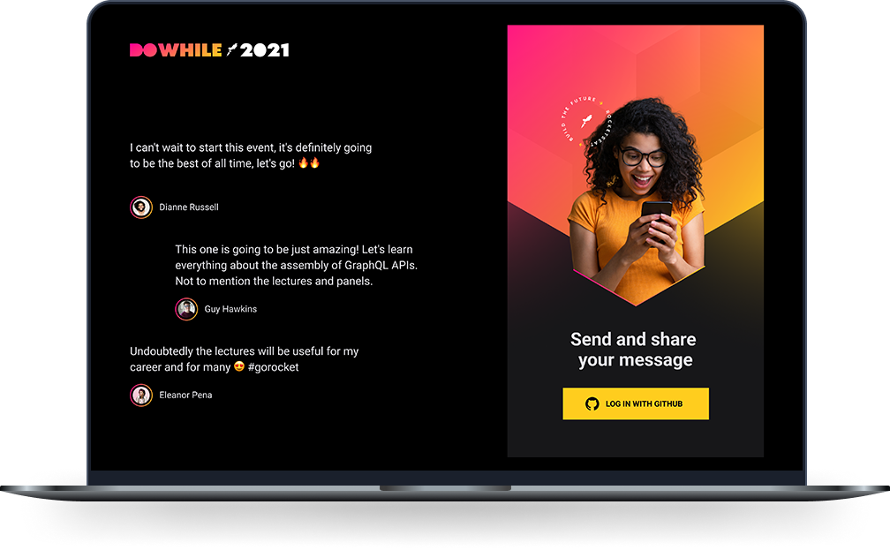

<h1 align="center">
  <a href="https://www.linkedin.com/in/kesleydavid/" target="_blank">
    
  </a>
</h1>

<p align="center">
  <a href="#">
    
  </a>
  <h3 align="center">Next Level Week Heat</h3>
</p>

<p align="center">
  <a href="#-preview">Preview</a>&nbsp;&nbsp;&nbsp;|&nbsp;&nbsp;&nbsp;
  <a href="#-project">Project</a>&nbsp;&nbsp;&nbsp;|&nbsp;&nbsp;&nbsp;
  <a href="#-next-level">Next Level</a>&nbsp;&nbsp;&nbsp;|&nbsp;&nbsp;&nbsp;
  <a href="#-technologies">Technologies</a>&nbsp;&nbsp;&nbsp;|&nbsp;&nbsp;&nbsp;
  <a href="#-getting-started">Getting started</a>&nbsp;&nbsp;&nbsp;|&nbsp;&nbsp;&nbsp;
  <a href="#-tests">Tests</a>&nbsp;&nbsp;&nbsp;|&nbsp;&nbsp;&nbsp;
  <a href="#-movie">Movie</a>&nbsp;&nbsp;&nbsp;|&nbsp;&nbsp;&nbsp;
  <a href="#-license">License</a>
</p>

<p align="center">

  <a href="#">
    
  </a>

  <a href="https://www.linkedin.com/in/kesleydavid/" target="_blank">
    
  </a>

  <a href="#">
    
  </a>

  <a href="./LICENSE">
    
  </a>

</p>

<p align="center">
    
</p>

<hr>

## ✨ Preview

Online system  
[https://dowhile-kesleydev.vercel.app/](https://dowhile-kesleydev.vercel.app/)  

## 💻 Project

Project developed in NLW Heat's Impulse mission.  

DoWhile2021 is an application layout where people can share their expectations about DoWhile.  

The project has 4 different modes:
- [node JS server (backend)](https://github.com/KesleyDavid/study_NLW_7_DoWhile_Node)
- [react JS web (frontend)](https://github.com/KesleyDavid/study_NLW_7_DoWhile_React)
- [reactNative JS (mobile)](https://github.com/KesleyDavid/study_NLW_7_DoWhile_ReactNative)
- [elixir](https://github.com/KesleyDavid/study_NLW_7_DoWhile_Elixir)

**FUNCTIONALITIES:** 

- Update of comments in real time for all connected devices (web and mobile)
- Authentication with github


## 💎 Next Level

```bash
  # Coming soon
```

## 🔖 Technologies

This project was developed using the following technologies:  

- [React](https://reactjs.org)
- [TypeScript](https://www.typescriptlang.org/)
- [Vite](https://vitejs.dev)
- [Socket IO](https://socket.io)
- [React Icons](https://react-icons.github.io/react-icons/)
- [SASS](https://sass-lang.com)
- [Axios](https://github.com/axios/axios)

## 🚀 Getting started

### Requirements
- [Backend server running](https://github.com/KesleyDavid/study_NLW_7_DoWhile_Node)


Follow the steps:
```bash
# Clone the project
$ git clone https://github.com/KesleyDavid/study_NLW_7_DoWhile_React.git

# Access the directory
$ cd study_NLW_7_DoWhile_React

# Install the dependencies
$ yarn

# Start the project
$ yarn dev
```

## 🥇 Tests

```bash
  # Coming soon
```

<!-- Run tests
```bash
$ yarn test
```

 -->

## 🎬 Movie


## 📝 License

This project is licensed under the MIT License. See [LICENSE](LICENSE) file for details.


---

<p align="center">Made with ♥ by <a href="https://www.linkedin.com/in/kesleydavid/" target="_blank">Kesley DEV</a>. See other projects on my <a href="https://www.kesley.dev" target="_blank">website</a>.</p>
